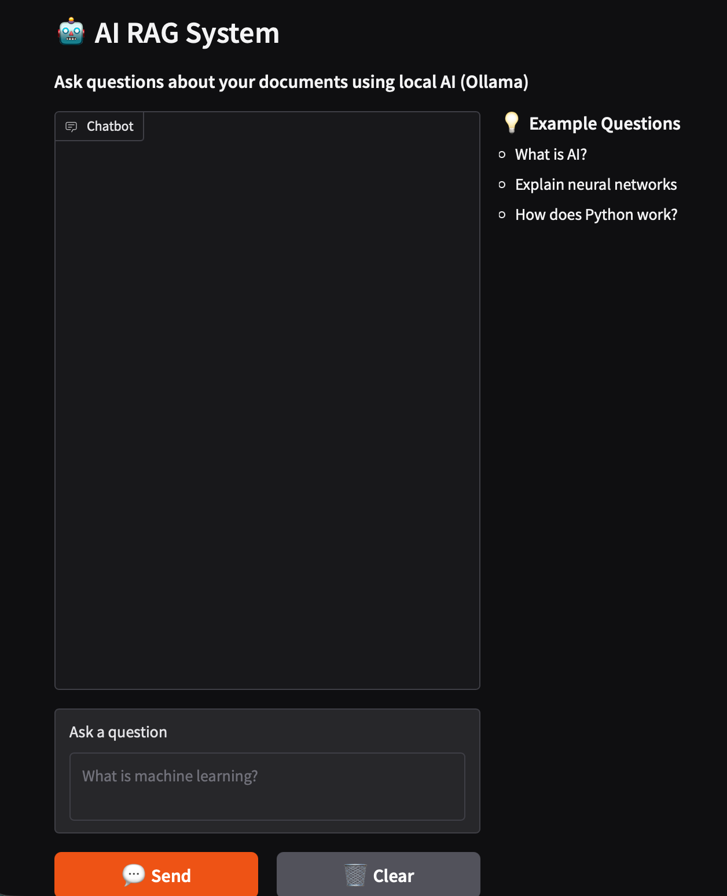

# 🤖 AI RAG System

> **Production-Ready RAG** (Retrieval Augmented Generation) with knowledge base. Build AI that actually knows your documents.

[](https://python.org)
[](LICENSE)
[](https://github.com/walidsobhie-code/ai-rag-system/stargazers)

## 🎯 What It Does

```
You: "What was the Q4 revenue growth?"
AI:  "Based on the quarterly report, Q4 revenue grew 
      23% year-over-year, reaching $4.2M..."
```

**RAG** lets AI answer questions about YOUR documents — not just general knowledge.

## ✨ Features

| Feature | Description |
|---------|-------------|
| 📄 **Multi-Format** | PDF, DOCX, TXT, Markdown support |
| 💾 **Vector Storage** | ChromaDB for fast semantic search |
| 🤖 **GPT-4** | State-of-the-art language model |
| 🎛️ **Gradio UI** | Beautiful web interface |
| 🐳 **Docker** | One-command deployment |
| ⚡ **Fast RAG** | Sub-second retrieval |

## 🚀 Quick Start

### 1. Install
```bash
git clone https://github.com/walidsobhie-code/ai-rag-system.git
cd ai-rag-system
pip install -r requirements.txt
cp .env.example .env
# Add your OPENAI_API_KEY to .env
```

### 2. Ingest Your Documents
```bash
# Ingest a PDF
python rag_engine.py --ingest ./docs/report.pdf

# Ingest multiple documents
python rag_engine.py --ingest ./docs/

# Output:
# 📄 Ingesting: ./docs/report.pdf
# ✅ Ingested 47 chunks
```

### 3. Query Your Knowledge Base
```bash
python rag_engine.py --query "What is the main finding?"

# 💬 Answer:
# Based on the documents, the main finding is...
```

### 4. Use the Web UI
```bash
python gradio_app.py
# Opens: http://localhost:7860
```

## 🎨 Demo

```
┌─────────────────────────────────────────────────────┐
│  🤖 AI RAG System                                 │
├─────────────────────────────────────────────────────┤
│  📄 Upload Document                               │
│  [Drag & drop PDF/DOCX/TXT]                       │
│                                                     │
│  💬 Ask Questions                                 │
│  "What are the key metrics?"                       │
│                                                     │
│  📊 Results                                        │
│  ✓ Source: Q4_Report.pdf (92% match)             │
│  ✓ Source: Metrics.xlsx (87% match)               │
│                                                     │
│  💡 Answer: The key metrics are...               │
└─────────────────────────────────────────────────────┘
```

## 📖 Real Example

```python
from rag_engine import RAGEngine

# Create RAG engine
rag = RAGEngine()

# Ingest company handbook
rag.ingest("./docs/employee-handbook.pdf")

# Ask questions
result = rag.chat("How many vacation days do I get?")
print(result["answer"])
# "Based on the employee handbook, you receive 
#  25 days of annual vacation..."

# Get sources
for source in result["sources"]:
    print(f"📄 {source['source']} ({source['score']:.0%} match)")
```

## 🐳 Docker Deployment

```bash
# Build
docker build -t ai-rag-system .

# Run
docker-compose up -d

# Access at http://localhost:7860
```

## 🛠️ Requirements

- Python 3.10+
- OpenAI API Key
- 4GB+ RAM for embeddings

## 📁 Project Structure

```
ai-rag-system/
├── rag_engine.py       # Core RAG engine
├── gradio_app.py      # Web UI
├── requirements.txt    # Dependencies
├── Dockerfile        # Container
└── examples/         # Usage examples
```

## 🤝 Contributing

Contributions welcome! See [CONTRIBUTING.md](CONTRIBUTING.md)

## 📝 License

MIT License

## ⭐ Show Your Support

If this helped you, please star the repo!

---

**Built with ❤️ by [walidsobhie-code](https://github.com/walidsobhie-code)**

## 🖥️ Demo Screenshot


